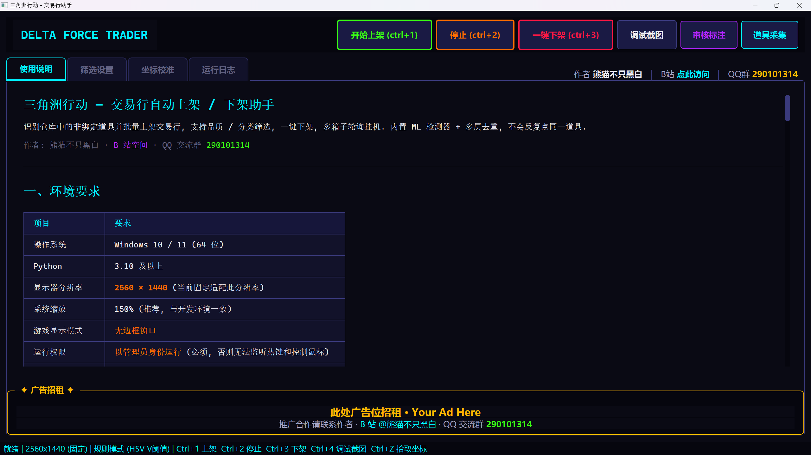
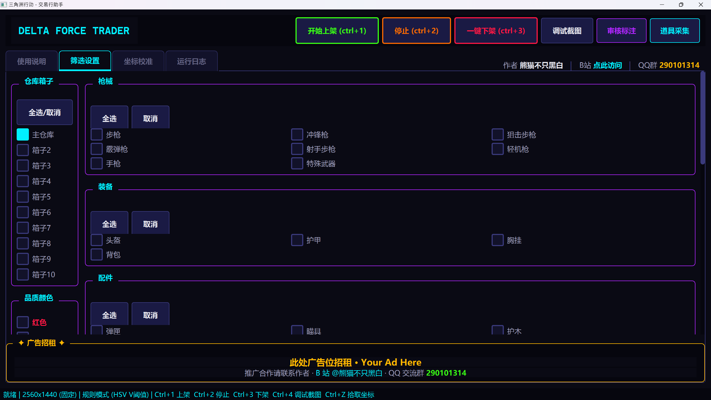
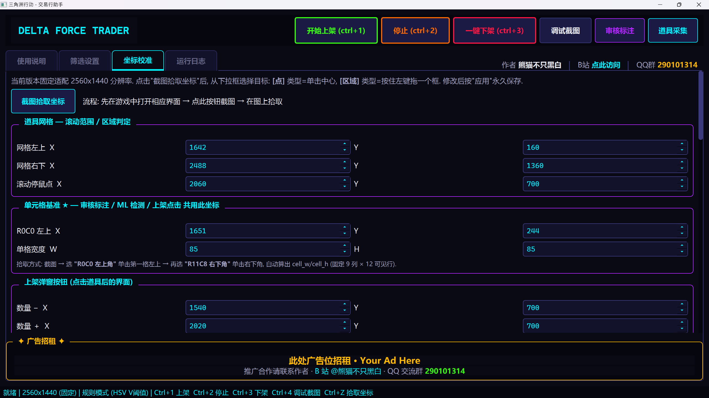
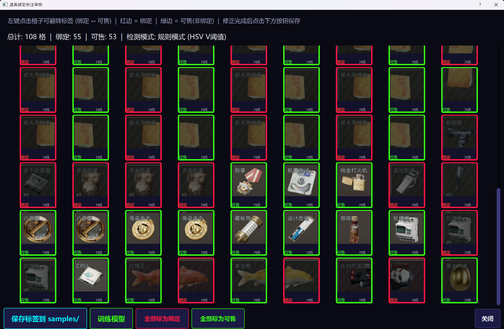

# Delta Force Trader — Auto Listing / Delisting Bot

[](https://github.com/xinshuowl/DeltaForce-Trader/actions/workflows/build.yml)
[](https://github.com/xinshuowl/DeltaForce-Trader/releases/latest)
[](LICENSE)
[](https://github.com/xinshuowl/DeltaForce-Trader/releases)
[](https://www.python.org/)
[](https://riverbankcomputing.com/software/pyqt/)
[](https://github.com/xinshuowl/DeltaForce-Trader/stargazers)

[中文](./README.md) · **English**

> **Listing a full storage manually takes 30 minutes. This tool does it in 3.**
> One hotkey to bulk-list all non-bound items from your storage to the marketplace, auto-delist sold items, sort storage, and loop — fully unattended.

Three-axis precise filtering (rarity / category / storage box), ML-powered item detection, multi-box rotation AFK mode.
Perfect for Haff-coin grinding, bulk inventory clearing, daily marketplace activity farming.

[**Download Pre-built EXE**](https://github.com/xinshuowl/DeltaForce-Trader/releases/latest) · [**Video Demo (Bilibili)**](https://space.bilibili.com/13591468) · [**QQ Group: 290101314**](#feedback)

> If this tool saves you time, **please ⭐ Star** — the biggest motivation for future updates!

---

## Demo

<p align="center">
  
  <br/>
  <em>Live screen capture · 17 items listed in 30s · 1.2M Haff-coin expected revenue</em>
</p>

### Screenshots

<table>
  <tr>
    <td align="center"><br/><em>Main control panel · start/stop + live log</em></td>
    <td align="center"><br/><em>Rarity / category / box 3-axis filter</em></td>
  </tr>
  <tr>
    <td align="center"><br/><em>30+ visual coordinate calibrators</em></td>
    <td align="center"><br/><em>In-app ML labeling + retrain</em></td>
  </tr>
</table>

---

## Why This Bot?

| Pain Point | Other Scripts | This Project |
|-----------|:-------------:|:------------:|
| Repeated clicks on multi-cell items (e.g. 8-cell gun) | ❌ Common bug | ✅ Connected-components merge |
| Tracking already-handled items across pages | ❌ Position-only, error-prone | ✅ 3-layer: name + image fingerprint + position |
| Premature page turn missing items | ❌ Single detection | ✅ Double-bottom confirmation + re-scan validation |
| Adapting to your screen resolution | ❌ Edit source code | ✅ 30+ GUI calibration knobs |
| ML inaccuracy fix | ❌ Reinstall / abandon | ✅ Built-in label-and-retrain UI |
| Revenue tracking | ❌ None | ✅ Auto-accumulate + deduct fees & deposit |

---

## Features

- **ML Item Detection** — RandomForest model + HSV rule dual-engine; classifies bound vs. non-bound items; retrainable from GUI.
- **Connected-components Merge** — A bare rifle occupying 4×2 = 8 cells is clicked exactly once.
- **3-layer Skip Mechanism** — Item **name** + **image dHash fingerprint** + **position blacklist**, all persisted across pages. Items not matching filter are never re-opened in the same box.
- **Double-bottom Confirmation** — Scroll-to-bottom requires two consecutive positive detections; no early page abort.
- **Filter System** — Rarity colors / multi-level categories / storage boxes combined with self-built OCR item database for precise control.
- **AFK Mode** — Fill 15 slots → wait N minutes → auto-delist sold items → sort storage → repeat. Fully unattended with cycle limit.
- **Visual Coordinate Calibration** — Screenshot + dropdown picker; 30+ coordinates / OCR ROIs adjustable, persisted to `user_config.json`.
- **Auto-minimize / Restore** — Window auto-minimizes on start, restores on finish.
- **Revenue Statistics** — Detailed item-by-item log with total expected revenue (fees and deposit pre-deducted).

---

## Requirements

| Item | Required |
|------|----------|
| OS | Windows 10 / 11 (64-bit) |
| Python | 3.10+ |
| Resolution | **2560 × 1440** (other resolutions need re-calibration) |
| DPI Scaling | **150%** (recommended; matches dev environment) |
| Game Display Mode | **Borderless Window** |
| Privilege | **Run as Administrator** (required for global hotkeys) |

---

## Installation

### 1. Install Python dependencies

```powershell
pip install -r requirements.txt
```

Deps: `pyautogui`, `opencv-python`, `Pillow`, `keyboard`, `PyQt5`, `numpy`, `pytesseract`, `rapidocr`, `scikit-learn`, `joblib`.

### 2. Install Tesseract-OCR (optional but recommended)

Tesseract reads listing count, item names, and expected revenue.

1. Download [tesseract-ocr-w64-setup-5.4.0.20240606.exe](https://digi.bib.uni-mannheim.de/tesseract/)
2. During install, expand **Additional language data** → check **Chinese - Simplified**
3. Add `C:\Program Files\Tesseract-OCR` to system `PATH`
4. Verify in a new PowerShell: `tesseract --version`

> Listing / delisting still works without Tesseract; only revenue and name stats will be blank.

### 3. Run

```powershell
# Must run with Administrator privilege, otherwise hotkeys and mouse control fail
python main.py
```

Or download the pre-built EXE from the [Releases page](https://github.com/xinshuowl/DeltaForce-Trader/releases/latest) — no Python install required.

---

## Quick Start

1. Right-click PowerShell → **Run as Administrator**
2. `cd` to project root and run `python main.py`
3. Switch to **「Filter Settings」** tab; check the storage boxes and rarities/categories you want to list
4. In game: open **Marketplace → Sell** page
5. Press **Ctrl+1** to start; window auto-minimizes; auto-restores on completion

---

## Hotkeys

| Hotkey | Action | Notes |
|--------|--------|-------|
| **Ctrl+1** | Start listing | Pops mode dialog (single / AFK); begins box traversal |
| **Ctrl+2** | Emergency stop | Instantly aborts; works any time |
| **Ctrl+3** | Bulk delist | Auto-delist all listed items + sort storage |
| **Ctrl+4** | Debug snapshot | Capture + run detection pipeline + dump annotated images |
| **Ctrl+Z** | Pick coords | Auto-minimize → screenshot → click/drag picker → fill spinbox |

---

## Listing Workflow (Ctrl+1)

```
Read listing status (OCR x/15)
        ↓
Sort storage
        ↓
Iterate checked boxes
   ├─→ Screenshot + ML detect non-bound items
   ├─→ Connected-components merge (multi-cell items folded into 1 group)
   ├─→ Filter (recently_listed / skip_positions / skip_fingerprints / skip_names)
   ├─→ Click → maximize quantity → OCR name + revenue
   │     ├─ Match filter → click "List"
   │     └─ No match → ESC, add to 3-layer blacklist
   ├─→ Page down (double-bottom confirmation)
   └─→ Next box
        ↓
Output revenue statistics to log
```

---

## Calibration

Coordinates are preset for **2560×1440 / 150% scaling**. If clicks miss, recalibrate:

1. Open **「Coordinate Calibration」** tab → click **Pick Coordinate** (or press **Ctrl+Z**)
2. Tool auto-minimizes and screenshots the game
3. Select target in dropdown:
   - **[Point]** — click on the target (e.g. button center)
   - **[Region]** — drag a rectangle (e.g. OCR area)
4. Click **Finish** → values populate the spinbox
5. Click **Apply All (Persist)** to save to `user_config.json`

---

## ML Model & Review

`ml_data/bound_model.joblib` is a pre-trained RandomForest binary classifier (bound vs. non-bound). To improve accuracy:

1. In game: stand on Sell page → Main UI → click **「Review Labels」**
2. App screenshots and auto-labels each cell
3. Manually correct any wrong labels
4. Click **「Train Model」** to retrain with accumulated samples

---

## Project Structure

```
Autoshop/
├── main.py                  # Entry point, hotkey registration
├── config.py                # Coordinates, item categories, timings
├── requirements.txt
├── user_config.json         # User customizations (coords, filter); auto-created
├── core/
│   ├── screen.py            # Screen capture
│   ├── detector.py          # Item detector (grid + OCR)
│   ├── ml_detector.py       # ML bound detector (RandomForest)
│   ├── automation.py        # Mouse / keyboard ops (pyautogui)
│   ├── workflow.py          # Listing / delisting workflow engine
│   ├── item_database.py     # Item DB (rarity / category match)
│   └── resolution.py        # Resolution scaling (currently disabled)
├── gui/
│   ├── main_window.py
│   ├── review_dialog.py
│   ├── shop_collector.py
│   └── theme.py
├── ml_data/
├── Shop/
├── listings/
├── logs/
└── docs/screenshots/        # README screenshots
```

---

## FAQ

| Issue | Fix |
|-------|-----|
| Hotkey not working | Run as Administrator |
| Click position offset | Recalibrate via "Coordinate Calibration" |
| Repeated clicks on the same gun | Already fixed with connected-components + dHash; rerun "Review Labels" if needed |
| Page skipped without bottom | Already fixed with double-bottom check; verify `page_change_*` calibration |
| Listing count OCR wrong | Inspect `debug_listing_count.png`; tweak `counter_x1~y2` |
| Bound detection inaccurate | Use "Review Labels" + retrain |
| Crash 0xC0000005 | Close other screen capture / recording software |
| Not 2560×1440 | Current version supports only this resolution |
| `No module named ...` | `pip install -r requirements.txt` |
| `tesseract is not installed` | Install Tesseract and add to PATH |

---

## Important Notes

- **Do not move mouse** while the script runs
- **Ctrl+2** for emergency stop
- Move mouse to top-left corner triggers PyAutoGUI fail-safe to stop
- Marketplace slot cap is 15; AFK mode handles delisting automatically

---

## Feedback

| Channel | URL |
|---------|-----|
| Author | 熊猫不只黑白 |
| Bilibili | https://space.bilibili.com/13591468 |
| QQ Group | **290101314** |
| GitHub Issues | [Open an issue](https://github.com/xinshuowl/DeltaForce-Trader/issues/new/choose) |
| GitHub Discussions | [Start a thread](https://github.com/xinshuowl/DeltaForce-Trader/discussions) |

For bugs, attach `logs/autoshop_*.log` from the "Run Log" tab.

---

## Disclaimer

This project is for **educational and research purposes only**. Users assume **all account risk and asset loss**. Comply with the game's Terms of Service. The author is not responsible for account bans or item losses.

---

## License

[MIT License](LICENSE) © 2026 [熊猫不只黑白](https://github.com/xinshuowl)

If this project helps you, please give it a ⭐ Star — it's free and means a lot!
